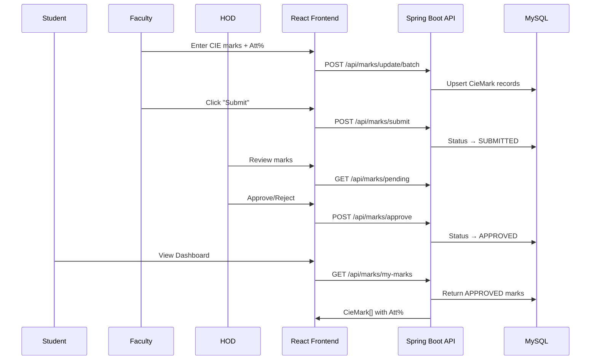
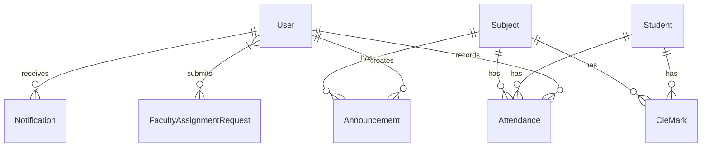

# IA Management System — Full Project Report

## 1. Project Overview

The **IA Management System** is a full-stack web application for managing **Continuous Internal Evaluation (CIE)** marks in an academic institution. It supports **four user roles** — Student, Faculty, HOD, and Principal — each with a dedicated dashboard.

| Layer | Technology | Port |
|-------|-----------|------|
| **Frontend** | React 18 + React Router | `3000` |
| **Backend** | Spring Boot 3 (Java) | `8084` |
| **Database** | MySQL | `3306` |
| **Auth** | JWT (JSON Web Token) | — |

---

## 2. Backend — Spring Boot

### 2.1 Configuration

| Property | Value |
|---|---|
| Database URL | `jdbc:mysql://localhost:3306/ia_management_nodejs` |
| DDL Strategy | `update` (auto-creates/alters tables) |
| JWT Expiry | 10 hours (`36000000` ms) |
| Password Encoding | BCrypt |
| Session | Stateless (JWT) |

---

### 2.2 Entities (Database Tables)

#### `User` → table `users`
**Purpose:** Stores all system users — HOD, Faculty, Principal, and Student login accounts.

| Field | Type | Purpose |
|-------|------|---------|
| `id` | Long (PK) | Auto-generated ID |
| `username` | String (unique) | Login username |
| `password` | String | BCrypt-hashed password (write-only in JSON) |
| `fullName` | String | Display name |
| `email` | String | Email address |
| `designation` | String | Job title |
| `department` | String | Department name |
| `role` | String | `HOD`, `FACULTY`, `PRINCIPAL`, or `STUDENT` |
| `semester` | String | Assigned semester (for faculty) |
| `section` | String | Comma-separated sections, e.g. `"A,B"` |
| `subjects` | TEXT | Comma-separated subject names assigned |

---

#### `Student` → table `students`
**Purpose:** Student profile data, separate from login credentials.

| Field | Type | Purpose |
|-------|------|---------|
| `id` | Long (PK) | Auto-generated ID |
| `regNo` | String (unique) | Registration number (also used as username) |
| `name` | String | Full name |
| `department` | String | Department code |
| `semester` | Integer | Current semester |
| `section` | String | Section (A, B, etc.) |
| `email`, `phone`, `parentPhone` | String | Contact details |

---

#### `Subject` → table `subjects`
**Purpose:** Academic subjects offered per department/semester.

| Field | Type | Purpose |
|-------|------|---------|
| `id` | Long (PK) | Auto-generated ID |
| `name` | String | Subject name |
| `code` | String (unique) | Subject code |
| `department` | String | Department |
| `semester` | Integer | Semester offered |
| `instructorName` | String | Assigned instructor |
| `credits` | Integer | Credit hours |
| `maxMarks` (virtual) | Integer | Always returns `50` (each CIE out of 50) |

---

#### `CieMark` → table `cie_marks`
**Purpose:** Individual CIE marks — one record per student × subject × CIE type.

| Field | Type | Purpose |
|-------|------|---------|
| `id` | Long (PK) | Auto-generated ID |
| `student` | ManyToOne → Student | Student reference |
| `subject` | ManyToOne → Subject | Subject reference |
| `cieType` | String | `CIE1`, `CIE2`, `CIE3`, `CIE4`, `CIE5` |
| `marks` | Double | Score (out of 50) |
| `status` | String | `PENDING` → `SUBMITTED` → `APPROVED`/`REJECTED` |
| `attendancePercentage` | Double | Student attendance % |

---

#### `Attendance` → table `attendance`
**Purpose:** Daily attendance records per student per subject.

| Field | Type | Purpose |
|-------|------|---------|
| `student` | ManyToOne → Student | Student reference |
| `subject` | ManyToOne → Subject | Subject reference |
| `date` | LocalDate | Attendance date |
| `status` | String | `PRESENT` or `ABSENT` |
| `faculty` | ManyToOne → User | Recording faculty |

---

#### `Announcement` → table `announcements`
**Purpose:** CIE exam schedule announcements.

| Field | Type | Purpose |
|-------|------|---------|
| `subject` | ManyToOne → Subject | Exam subject |
| `cieNumber` | String | Which CIE (CIE-1, CIE-2, etc.) |
| `scheduledDate` | LocalDate | Exam date |
| `startTime` | String | Start time (e.g. `"10:00 AM"`) |
| `durationMinutes` | Integer | Exam duration |
| `examRoom` | String | Room number |
| `status` | String | `SCHEDULED` or `COMPLETED` |
| `faculty` | ManyToOne → User | Announcing faculty |
| `syllabusCoverage` | String (2000) | Topics covered |

---

#### `FacultyAssignmentRequest` → table `faculty_assignment_requests`
**Purpose:** Cross-department subject assignment requests from faculty to HOD.

| Field | Type | Purpose |
|-------|------|---------|
| `facultyId` | Long | Requesting faculty's user ID |
| `facultyName` | String | Display name |
| `targetDepartment` | String | Department they want to teach in |
| `subjects` | TEXT | Comma-separated requested subjects |
| `sections` | String | Comma-separated sections |
| `semester` | String | Target semester |
| `status` | String | `PENDING` → `APPROVED`/`REJECTED` |
| `requestDate`, `responseDate` | LocalDateTime | Timestamps |

---

#### `Notification` → table `notifications`
**Purpose:** In-app notifications for all users.

| Field | Type | Purpose |
|-------|------|---------|
| `user` | ManyToOne → User | Target user |
| `message` | String | Notification text |
| `type` | String | `INFO`, `WARNING`, `ALERT` |
| `isRead` | boolean | Read/unread status |
| `category` | String | Source label (e.g. `"HOD - CS"`) |
| `createdAt` | LocalDateTime | Auto-set timestamp |

---

### 2.3 Repositories (Data Access Layer)

All repositories extend `JpaRepository` providing standard CRUD. Custom query methods:

| Repository | Key Methods |
|---|---|
| `UserRepository` | `findByUsername()`, `findByUsernameIgnoreCase()`, `findByRole()`, `findByRoleAndDepartment()`, `countByRoleAndDepartment()` |
| `StudentRepository` | `findByRegNo()`, `findByDepartment()`, `findBySectionIn()` |
| `SubjectRepository` | `findByDepartment()`, `findByCode()`, `findByNameIn()`, `findByDepartmentAndSemester()`, `findByInstructorName()` |
| `CieMarkRepository` | `findByStudent_Id()`, `findBySubject_Id()`, `findByStudent_IdAndSubject_IdAndCieType()`, `findByStatusAndSubject_Department()`, `deleteZeroValueSubmittedMarks()` (cleanup), `nullifyZeroPendingMarks()` |
| `AnnouncementRepository` | `findBySubjectIdIn()` |
| `AttendanceRepository` | — (standard CRUD) |
| `NotificationRepository` | `findByUserIdOrderByCreatedAtDesc()`, `deleteByUserId()` |
| `FacultyAssignmentRequestRepository` | `findByFacultyId()`, `findByFacultyIdAndTargetDepartmentAndStatus()`, `findByTargetDepartment()`, `findByTargetDepartmentAndStatus()` |

---

### 2.4 Services (Business Logic)

#### `AuthService`
| Method | Purpose |
|--------|---------|
| `authenticateUser(LoginRequest)` | Validates credentials via Spring Security `AuthenticationManager`, generates JWT token, returns `JwtResponse` with token, user ID, username, email, role, fullName, and department |
| `registerUser(SignupRequest)` | Creates new user with BCrypt-encoded password |

#### `MarksService`
| Method | Purpose |
|--------|---------|
| `getMarksBySubject(subjectId)` | Returns all CIE marks for a subject |
| `getMarksByStudentUsername(username)` | Returns non-PENDING marks for a student (by regNo) |
| `getMarksByStudentId(studentId)` | Returns all marks for a student by ID |
| `updateBatchMarks(List<CieMark>)` | Upserts marks — updates existing records or creates new ones; persists `attendancePercentage` |
| `submitMarks(subjectId, cieType, faculty)` | Changes status from `PENDING` → `SUBMITTED` for all marks of a CIE type |
| `getPendingApprovals(department)` | Returns `SUBMITTED` marks for a department (HOD review) |
| `approveMarks(subjectId, cieType)` | Changes status `SUBMITTED` → `APPROVED` |
| `rejectMarks(subjectId, cieType)` | Changes status `SUBMITTED` → `REJECTED` |
| `unlockMarks(subjectId, cieType)` | Resets marks to `PENDING` for re-editing; creates placeholder records for students missing that CIE type |

#### `FacultyService`
| Method | Purpose |
|--------|---------|
| `getSubjectsForFaculty(username)` | Returns subjects assigned to a faculty — from their `subjects` field + approved cross-department assignments |
| `getStudentsForFaculty(username)` | Returns students filtered by faculty's assigned sections + cross-dept approved sections |
| `getAnalytics(username)` | Calculates class analytics: total evaluated, average score %, low performers (<20), top performers (≥40), with a list of bottom 5 |

#### `StudentService`
| Method | Purpose |
|--------|---------|
| `getAllStudents(department)` | Lists all students, optionally filtered by department |
| `getStudentByRegNo(regNo)` | Finds a single student by registration number |
| `getFacultyForStudent(username)` | Returns faculty teaching the student's semester subjects, filtered by section match |
| `getStudentsWithAnalytics(department)` | Returns students with their CIE marks map |

#### `CieService`
| Method | Purpose |
|--------|---------|
| `getStudentAnnouncements(username)` | Returns exam announcements for the student's department/semester subjects |
| `getStudentNotifications(username)` | Returns notifications for the student's user account |
| `getFacultySchedules(username)` | Returns exam announcements for subjects the faculty teaches |

---

### 2.5 Controllers (REST API Endpoints)

#### `AuthController` — `/api/auth`
| Method | Endpoint | Access | Purpose |
|--------|----------|--------|---------|
| `POST` | `/login` | Public | User login → returns JWT + user info |
| `POST` | `/signup` | Public | Register new user |

---

#### `MarksController` — `/api/marks`
| Method | Endpoint | Access | Purpose |
|--------|----------|--------|---------|
| `GET` | `/subject/{subjectId}` | Faculty, HOD, Principal | Get all marks for a subject |
| `GET` | `/my-marks` | Student | Get logged-in student's marks |
| `GET` | `/student/{studentId}` | Faculty, HOD, Principal | Get marks for a specific student |
| `POST` | `/update/batch` | Faculty, HOD | Bulk update/create marks + attendance |
| `POST` | `/submit` | Faculty | Submit marks for approval |
| `GET` | `/pending` | HOD | Get pending-approval marks by department |
| `POST` | `/approve` | HOD | Approve submitted marks |
| `POST` | `/reject` | HOD | Reject submitted marks |
| `POST` | `/unlock` | HOD | Unlock marks for re-editing |

---

#### `StudentController` — `/api/student`
| Method | Endpoint | Access | Purpose |
|--------|----------|--------|---------|
| `GET` | `/all` | Any | Get all students (with analytics, optional dept filter) |
| `GET` | `/faculty` | Student | Get faculty teaching the student's subjects |
| `GET` | `/profile` | Student | Get the logged-in student's profile |

---

#### `FacultyController` — `/api/faculty`
| Method | Endpoint | Access | Purpose |
|--------|----------|--------|---------|
| `GET` | `/my-subjects` | Faculty | Get subjects assigned to logged-in faculty |
| `GET` | `/my-students` | Faculty | Get students in faculty's assigned sections |
| `GET` | `/analytics` | Faculty | Get class analytics (avg score, low/top performers) |
| `GET` | `/all-departments` | Faculty | List all distinct departments |
| `GET` | `/department-subjects?department=` | Faculty | Get subjects in a specific department |
| `POST` | `/assignment-request` | Faculty | Request to teach cross-department subjects |
| `GET` | `/my-assignment-requests` | Faculty | View status of assignment requests |

---

#### `HodController` — `/api/hod`
| Method | Endpoint | Access | Purpose |
|--------|----------|--------|---------|
| `GET` | `/overview?department=` | HOD | Full department dashboard data (students, faculty, subjects, marks summary, CIE status, announcements) |
| `GET` | `/faculty?department=` | HOD | List faculty in department |
| `GET` | `/assignment-requests?department=&status=` | HOD | View cross-dept assignment requests |
| `POST` | `/assignment-requests/{id}/approve` | HOD | Approve assignment request (updates faculty's subjects + subject's instructor) |
| `POST` | `/assignment-requests/{id}/reject` | HOD | Reject assignment request |
| `POST` | `/faculty` | HOD | Create new faculty user |
| `PUT` | `/faculty/{id}` | HOD | Update faculty details/subjects/sections |
| `DELETE` | `/faculty/{id}?department=` | HOD | Delete faculty (with cascade cleanup of related records) |
| `POST` | `/students` | HOD | Create new student + user account |
| `DELETE` | `/students/{regNo}` | HOD | Delete student + related records |
| `POST` | `/reset-password` | HOD | Reset any user's password |
| `POST` | `/upload-students` | HOD | Bulk CSV upload of students |
| `POST` | `/students/bulk-delete` | HOD | Bulk delete students by regNo list |

---

#### `PrincipalController` — `/api/principal`
| Method | Endpoint | Access | Purpose |
|--------|----------|--------|---------|
| `GET` | `/dashboard` | Principal | Institution-wide analytics (department stats, marks summary, CIE status, top/at-risk students) |
| `GET` | `/faculty` | Principal | List all faculty |
| `GET` | `/timetables` | Principal | *(placeholder — returns empty)* |
| `POST` | `/seed-cie` | Principal | Seed CIE mark records for all students |
| `GET` | `/notifications` | Principal | *(placeholder)* |
| `GET` | `/reports` | Principal | *(placeholder)* |
| `GET` | `/grievances` | Principal | *(placeholder)* |
| `GET` | `/departments/{deptId}/students` | Principal | Get students in a department |
| `GET` | `/hods` | Principal | List all HODs |
| `POST` | `/hods` | Principal | Create new HOD |
| `PUT` | `/hods/{id}` | Principal | Update HOD details |
| `DELETE` | `/hods/{id}` | Principal | Delete HOD (cascade cleanup) |

---

#### `SubjectController` — `/api/subjects`
| Method | Endpoint | Access | Purpose |
|--------|----------|--------|---------|
| `GET` | `/department/{department}` | HOD, Principal, Faculty | List subjects by department |
| `GET` | `/all` | HOD, Principal | List all subjects |
| `POST` | `/` | HOD | Create new subject |
| `DELETE` | `/{id}` | HOD | Delete subject |
| `PUT` | `/{id}` | HOD | Update subject details |

---

#### `CieController` — `/api/cie`
| Method | Endpoint | Access | Purpose |
|--------|----------|--------|---------|
| `GET` | `/student/announcements` | Student | Get exam schedules for student's subjects |
| `GET` | `/student/notifications` | Student | Get student notifications |
| `GET` | `/faculty/schedules` | Faculty | Get exam schedules for faculty's subjects |
| `POST` | `/faculty/announce` | Faculty | Create exam announcement + notify students |
| `POST` | `/faculty/syllabus` | Faculty | Update syllabus coverage on an announcement |
| `POST` | `/hod/syllabus` | HOD | Update syllabus coverage (HOD version) |
| `GET` | `/faculty/announcement-details` | Faculty | Get announcement detail by subject + CIE |
| `GET` | `/hod/announcements` | HOD | Get all announcements in HOD's department |
| `GET` | `/hod/notifications` | HOD | Get HOD's notifications |
| `POST` | `/hod/announcements` | HOD | Create announcement (HOD) |
| `PUT` | `/hod/announcements/{id}` | HOD | Update announcement |
| `DELETE` | `/hod/announcements/{id}` | HOD | Delete announcement |

---

#### `NotificationController` — `/api/notifications`
| Method | Endpoint | Access | Purpose |
|--------|----------|--------|---------|
| `GET` | `/` | All roles | Get logged-in user's notifications |
| `POST` | `/broadcast` | HOD, Principal | Broadcast notification to a role (within dept or institution-wide) |
| `DELETE` | `/clear` | All roles | Clear all notifications for logged-in user |
| `DELETE` | `/{id}` | All roles | Delete a single notification (ownership check) |
| `POST` | `/{id}/read` | All roles | Mark notification as read |

---

#### `AnalyticsController` — `/api/analytics`
| Method | Endpoint | Access | Purpose |
|--------|----------|--------|---------|
| `GET` | `/department/{deptId}/stats` | HOD, Principal | Department statistics: student count, faculty count, pass %, at-risk count |

---

#### `DebugController` — `/api/debug`
| Method | Endpoint | Access | Purpose |
|--------|----------|--------|---------|
| `GET` | `/user/{username}` | Public | Debug: lookup user password hash |
| `GET` | `/users?role=` | Public | Debug: list users, optionally by role |

---

### 2.6 Security Architecture

| Component | Purpose |
|-----------|---------|
| `WebSecurityConfig` | Configures stateless JWT auth, CORS (all origins), BCrypt encoder, public endpoints (`/api/auth/**`, `/api/debug/**`, `/api/cie/**`) |
| `AuthTokenFilter` | Intercepts each request, extracts JWT from `Authorization` header, validates, and sets `SecurityContext` |
| `JwtUtils` | Generates and validates JWT tokens using HMAC-SHA key |
| `UserDetailsImpl` | Implements Spring Security `UserDetails` — wraps the `User` entity |
| `UserDetailsServiceImpl` | Loads `UserDetails` from the database by username |

---

## 3. Frontend — React

### 3.1 Tech Stack
- **React 18** with functional components & hooks
- **React Router v6** for client-side routing
- **CSS Modules** (per-page `.module.css` files)
- **Context API** for auth state management
- **Fetch API** for HTTP requests

### 3.2 Routing (`App.js`)

| Route | Component | Access |
|-------|-----------|--------|
| `/login` | `Login` | Public |
| `/` | Redirects to `/login` | — |
| `/dashboard/student` | `StudentDashboard` | `student` role |
| `/dashboard/faculty` | `FacultyDashboard` | `faculty` role |
| `/dashboard/hod` | `HODDashboard` | `hod` role |
| `/dashboard/principal` | `PrincipalDashboard` | `principal` role |

Protected routes use `<ProtectedRoute allowedRoles={[...]}/>` which checks `AuthContext`.

### 3.3 Auth Context (`AuthContext.js`)

| Function | Purpose |
|----------|---------|
| `login(username, password)` | Posts to `/api/auth/login`, stores user data (username, role, token, department, fullName) in `localStorage` and React state |
| `logout()` | Clears `localStorage` and resets state |
| `useAuth()` | Custom hook exposing `{ user, login, logout, loading }` |
| Mock mode | Built-in mock login for frontend-only development (disabled by default) |

### 3.4 Frontend Pages

#### `Login.js` (14 KB)
- **Purpose:** Unified login page for all roles
- **Features:** Username/password form, role detection post-login, auto-redirect to correct dashboard

#### `StudentDashboard.js` (41 KB)
- **Purpose:** Student's personal academic dashboard
- **Tabs/Sections:**
  - **Overview** — CIE marks summary with attendance %, performance statistics
  - **CIE Marks** — Detailed marks per subject per CIE type with Att% column
  - **Exam Schedule** — Upcoming/past CIE announcements with syllabus coverage
  - **My Faculty** — Faculty details for enrolled subjects
  - **Notifications** — In-app notification panel

#### `FacultyDashboard.js` (178 KB — largest file)
- **Purpose:** Faculty's operational command center
- **Tabs/Sections:**
  - **Overview** — Quick stats, CIE status, class analytics
  - **CIE Entry** — Mark entry table with per-CIE columns + Att% input + submit/save actions
  - **My Students** — Student list with registration numbers and sections
  - **CIE Schedule** — Manage exam announcements (create, update syllabus coverage)
  - **Notifications** — Notification panel
  - **Cross-Department** — Request to teach subjects in other departments, view request statuses

#### `HODDashboard.js` (155 KB)
- **Purpose:** Department management and CIE oversight
- **Tabs/Sections:**
  - **Overview** — Department summary (faculty count, student count, subjects, CIE completion status, announcements)
  - **Faculty Management** — CRUD faculty, assign subjects/sections, reset passwords
  - **Student Management** — CRUD students, CSV bulk upload, bulk delete
  - **IA Monitoring** — View all marks per subject with Att% column, approve/reject/unlock CIE marks
  - **CIE Schedule** — Manage department-wide exam announcements with syllabus coverage
  - **Approvals** — Review & manage cross-department assignment requests
  - **Subjects** — Create/Edit/Delete subjects
  - **Notifications** — Broadcast to faculty, manage notifications

#### `PrincipalDashboard.js` (18 KB)
- **Purpose:** Institution-wide administrative overview
- **Tabs/Sections:**
  - **Overview** — Cross-department stats, top/at-risk students, institution-wide analytics
  - **HOD Management** — CRUD HODs (create, update, delete with cascade)
  - **Notifications** — Broadcast notifications (institution-wide or per department)

### 3.5 Shared Components

| Component | Purpose |
|-----------|---------|
| `DashboardLayout.js` | Wraps dashboard pages with sidebar + header layout |
| `Sidebar.js` | Left navigation sidebar with role-based menu items |
| `RightSidebar.js` | Optional right panel for notifications/info |
| `ProtectedRoute.js` | Route guard — redirects to `/login` if not authenticated or wrong role |
| `NotificationPanel.js` | Reusable notification list with mark-as-read and delete |
| `UnlockMarksPanel_component.js` | HOD panel for unlocking CIE marks for re-editing |

### 3.6 Services & Config

| File | Purpose |
|------|---------|
| `config/api.js` | Exports `API_BASE_URL` (e.g. `http://localhost:8084/api`) |
| `context/AuthContext.js` | Authentication state management (described above) |
| `context/ThemeContext.js` | Dark/light theme toggle context |

---

## 4. Data Flow Summary

---

## 5. Marks Approval Workflow

| Status | Meaning | Who Can See |
|--------|---------|-------------|
| `PENDING` | Faculty has entered/saved marks but not submitted | Faculty only |
| `SUBMITTED` | Faculty submitted for HOD review | Faculty + HOD |
| `APPROVED` | HOD approved the marks | Everyone including Student |
| `REJECTED` | HOD rejected — faculty can re-edit | Faculty (editable again) |

---

## 6. Key Database Relationships

