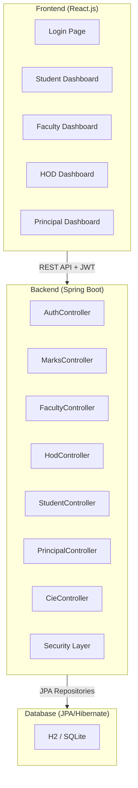
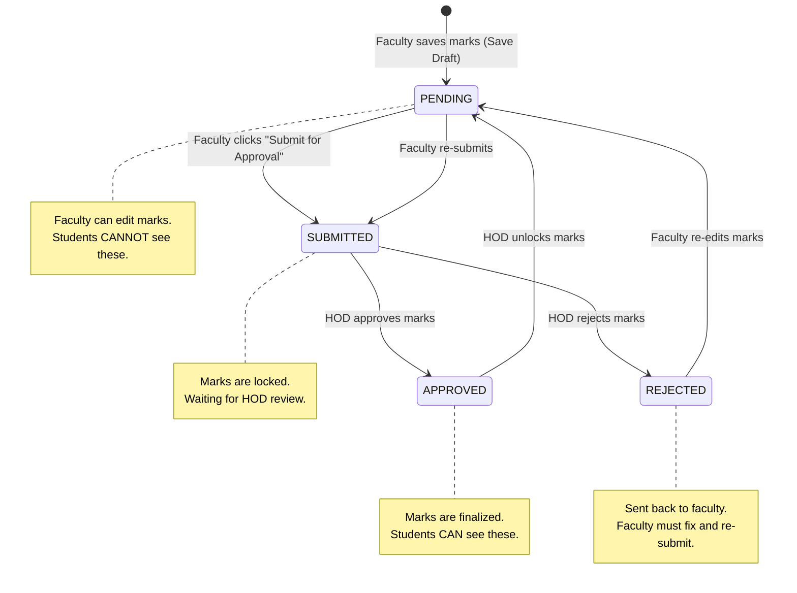
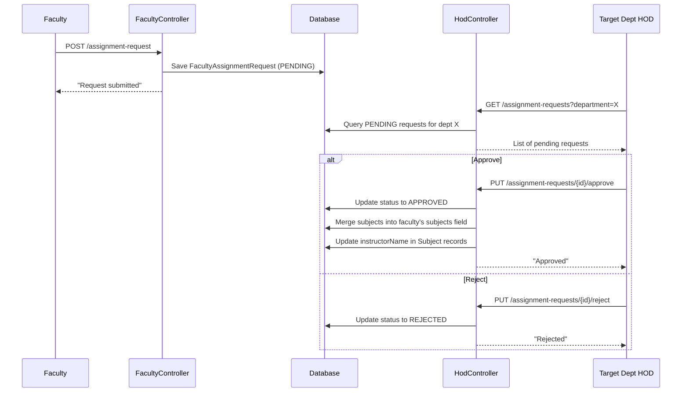

# IA Management System — Detailed Technical Report

## 1. System Architecture Overview

- **Frontend**: Built with **React.js** — single-page application (SPA) with role-based dashboards.
- **Backend**: Built with **Spring Boot (Java)** — RESTful API server using MVC architecture.
- **Database**: H2/SQLite via **JPA + Hibernate** ORM (auto-schema via `spring.jpa.hibernate.ddl-auto`).
- **Authentication**: **JWT (JSON Web Token)** — stateless, token-based auth with Spring Security.
- **Authorization**: Role-based access control using `@PreAuthorize` annotations with 4 roles: `STUDENT`, `FACULTY`, `HOD`, `PRINCIPAL`.

---

## 2. Backend — Spring Boot (Detailed Point-Wise)

### 2.1 Package Structure

| Package | Purpose | Files |
|---|---|---|
| `entity` | JPA entity classes (database tables) | 8 files |
| `controller` | REST API endpoints (request handling) | 11 files |
| `service` | Business logic layer | 5 files |
| `repository` | Data access layer (Spring Data JPA interfaces) | 8 files |
| `security` | JWT authentication & Spring Security config | 5 files |
| `payload.request` | Request DTOs (data transfer objects) | 3 files |
| `payload.response` | Response DTOs | 5 files |

---

### 2.2 Entity Classes (Database Models)

#### 2.2.1 User Entity ([User.java](file:///d:/IA_Management_system/backend-springboot/src/main/java/com/example/ia/entity/User.java))

- **Table name**: `users`
- **Purpose**: Stores login credentials and role information for ALL users (students, faculty, HODs, principal).
- **Key fields**:
  - `id` (Long) — Auto-generated primary key using `@GeneratedValue(strategy = GenerationType.IDENTITY)`.
  - `username` (String) — Unique, non-null. For students, this is their registration number.
  - `password` (String) — BCrypt-hashed. Annotated with `@JsonProperty(access = WRITE_ONLY)` so it is never sent back in API responses.
  - `role` (String) — One of: `STUDENT`, `FACULTY`, `HOD`, `PRINCIPAL`.
  - `fullName` (String) — Display name; `getFullName()` method returns `username` as fallback if `fullName` is null.
  - `email`, `designation`, `department` (String) — General profile fields.
  - `semester`, `section` (String) — Used for faculty (comma-separated sections like `"A,B"`).
  - `subjects` (TEXT) — Comma-separated list of subject names assigned to the faculty (e.g., `"Data Structures, Algorithms"`).
- **Key design decisions**:
  - A single `User` table serves all roles — no inheritance or separate tables per role.
  - The `subjects` field uses a comma-separated text column instead of a join table, for simplicity.

#### 2.2.2 Student Entity ([Student.java](file:///d:/IA_Management_system/backend-springboot/src/main/java/com/example/ia/entity/Student.java))

- **Table name**: `students`
- **Purpose**: Stores academic data for students (separate from login data in `User`).
- **Key fields**:
  - `id` (Long) — Auto-generated primary key.
  - `regNo` (String) — Unique registration number (also used as the `username` in the `User` table).
  - `name` (String) — Student's full name.
  - `department` (String) — e.g., `"CSE"`, `"ECE"`.
  - `semester` (Integer) — Current semester (1–8).
  - `section` (String) — Section assignment (e.g., `"A"`, `"B"`).
  - `email`, `phone`, `parentPhone` (String) — Contact details.
- **Relationship**: One-to-one with `User` table via `regNo == username`.

#### 2.2.3 Subject Entity ([Subject.java](file:///d:/IA_Management_system/backend-springboot/src/main/java/com/example/ia/entity/Subject.java))

- **Table name**: `subjects`
- **Purpose**: Represents academic subjects offered in the institution.
- **Key fields**:
  - `id` (Long) — Auto-generated primary key.
  - `name` (String) — Subject name (e.g., `"Data Structures"`).
  - `code` (String) — Unique subject code (e.g., `"CS301"`).
  - `department` (String) — Department offering the subject.
  - `semester` (Integer) — Which semester the subject is offered in.
  - `instructorName` (String) — Name of the assigned faculty.
  - `credits` (Integer) — Number of credits.
- **Special method**: `getMaxMarks()` — Always returns `50`. This is a computed getter (not a database column) that the frontend reads to know the maximum marks per CIE.

#### 2.2.4 CieMark Entity ([CieMark.java](file:///d:/IA_Management_system/backend-springboot/src/main/java/com/example/ia/entity/CieMark.java))

- **Table name**: `cie_marks`
- **Purpose**: Stores marks and attendance for each student per subject per CIE round.
- **Key fields**:
  - `id` (Long) — Auto-generated primary key.
  - `student` — `@ManyToOne` relationship to `Student` entity (foreign key `studentId`).
  - `subject` — `@ManyToOne` relationship to `Subject` entity (foreign key `subjectId`).
  - `cieType` (String) — Type of CIE: `"CIE1"`, `"CIE2"`, `"CIE3"`, `"CIE4"`, `"CIE5"`.
  - `marks` (Double) — Total marks obtained (out of 50). `null` means not yet entered.
  - `attendance` (Double) — Attendance percentage (0–100) for this CIE period.
  - `status` (String) — Workflow status: `"PENDING"` → `"SUBMITTED"` → `"APPROVED"` or `"REJECTED"`. Defaults to `"PENDING"`.
- **Frontend compatibility methods**:
  - `getTotalScore()` — Alias for `getMarks()` (frontend reads `totalScore`).
  - `getStudentId()` — Returns `student.getId()` as a flat field for JSON serialization.
  - `getSubjectId()` — Returns `subject.getId()` as a flat field for JSON serialization.

#### 2.2.5 Announcement Entity ([Announcement.java](file:///d:/IA_Management_system/backend-springboot/src/main/java/com/example/ia/entity/Announcement.java))

- **Table name**: `announcements`
- **Purpose**: Stores CIE exam schedules and syllabus coverage details.
- **Key fields**:
  - `subject` — `@ManyToOne` to `Subject`.
  - `cieNumber` (String) — e.g., `"CIE-1"`, `"CIE-2"`.
  - `scheduledDate` (LocalDate) — Date of the CIE exam.
  - `startTime` (String) — e.g., `"10:00 AM"`.
  - `durationMinutes` (Integer) — Duration of the exam in minutes.
  - `examRoom` (String) — Room/hall where the exam takes place.
  - `syllabusCoverage` (String, 2000 chars) — Topics covered, entered by faculty or HOD.
  - `status` (String) — `"SCHEDULED"`, `"COMPLETED"`, or `"SYLLABUS_ONLY"`.
  - `faculty` — `@ManyToOne` to `User` (who created/scheduled the CIE).

#### 2.2.6 Attendance Entity ([Attendance.java](file:///d:/IA_Management_system/backend-springboot/src/main/java/com/example/ia/entity/Attendance.java))

- **Table name**: `attendance`
- **Purpose**: Records daily attendance for students per subject.
- **Key fields**:
  - `student` — `@ManyToOne` to `Student`.
  - `subject` — `@ManyToOne` to `Subject`.
  - `date` (LocalDate) — Date of the attendance record.
  - `status` (String) — `"PRESENT"` or `"ABSENT"`.
  - `faculty` — `@ManyToOne` to `User` (who recorded the attendance).

#### 2.2.7 Notification Entity ([Notification.java](file:///d:/IA_Management_system/backend-springboot/src/main/java/com/example/ia/entity/Notification.java))

- **Table name**: `notifications`
- **Purpose**: Stores in-app notifications for users.
- **Key fields**:
  - `user` — `@ManyToOne` to `User` (the recipient).
  - `message` (String) — Notification text.
  - `type` (String) — `"INFO"`, `"WARNING"`, or `"ALERT"`.
  - `isRead` (boolean) — Whether the notification has been read. Defaults to `false`.
  - `category` (String) — Category for filtering.
  - `createdAt` (LocalDateTime) — Defaults to `LocalDateTime.now()`.

#### 2.2.8 FacultyAssignmentRequest Entity ([FacultyAssignmentRequest.java](file:///d:/IA_Management_system/backend-springboot/src/main/java/com/example/ia/entity/FacultyAssignmentRequest.java))

- **Table name**: `faculty_assignment_requests`
- **Purpose**: Enables cross-department faculty teaching. A faculty member can request to teach subjects in a different department; the HOD of that department approves/rejects the request.
- **Key fields**:
  - `facultyId` (Long) — The requesting faculty's user ID.
  - `facultyName` (String) — Display name of the faculty.
  - `targetDepartment` (String) — The department the faculty wants to teach in.
  - `subjects` (TEXT) — Comma-separated subject names requested.
  - `sections` (String) — Comma-separated section assignments.
  - `semester` (String) — Target semester.
  - `status` (String) — `"PENDING"`, `"APPROVED"`, or `"REJECTED"`.
  - `requestDate`, `responseDate` (LocalDateTime) — Timestamps.

---

### 2.3 Security Layer (JWT + Spring Security)

#### 2.3.1 WebSecurityConfig ([WebSecurityConfig.java](file:///d:/IA_Management_system/backend-springboot/src/main/java/com/example/ia/security/WebSecurityConfig.java))

- **Purpose**: Configures the entire Spring Security pipeline.
- **Key configurations**:
  - `@EnableMethodSecurity` — Enables `@PreAuthorize` annotations on controller methods.
  - **CSRF disabled** — Not needed for stateless JWT-based API.
  - **Session policy**: `STATELESS` — No server-side sessions; every request must carry a JWT.
  - **Public endpoints** (no authentication required):
    - `/api/auth/**` — Login and registration.
    - `/api/test/**`, `/api/debug/**` — Testing/debugging endpoints.
    - `/api/notifications/broadcast` — Broadcast notifications.
    - `/api/cie/**` — CIE endpoints (temporary fix).
  - **All other endpoints** require authentication.
  - **CORS**: Allows all origins (`*`), all HTTP methods, and `Authorization` / `Content-Type` headers.
  - **Password encoding**: Uses `BCryptPasswordEncoder`.
  - **JWT filter**: `AuthTokenFilter` is added before `UsernamePasswordAuthenticationFilter`.
- **Beans defined**:
  - `authenticationJwtTokenFilter()` — Creates the JWT filter bean.
  - `authenticationProvider()` — Configures `DaoAuthenticationProvider` with custom `UserDetailsService` and BCrypt encoder.
  - `authenticationManager()` — Exposes the `AuthenticationManager` for use in `AuthService`.
  - `passwordEncoder()` — BCrypt password encoder.
  - `corsConfigurationSource()` — CORS configuration source.

#### 2.3.2 JwtUtils ([JwtUtils.java](file:///d:/IA_Management_system/backend-springboot/src/main/java/com/example/ia/security/JwtUtils.java))

- **Purpose**: Utility class for generating, parsing, and validating JWT tokens.
- **Configuration properties** (from `application.properties`):
  - `app.jwtSecret` — The HMAC-SHA512 signing key.
  - `app.jwtExpirationMs` — Token expiration time in milliseconds.
- **Key functions**:
  - `getSigningKey()` — Converts the secret string to an HMAC key using `Keys.hmacShaKeyFor()`.
  - `generateJwtToken(Authentication auth)` — Creates a JWT with the username as subject, current time as issued-at, and configured expiration time. Signs with HS512.
  - `getUserNameFromJwtToken(String token)` — Parses the JWT and extracts the username (subject claim).
  - `validateJwtToken(String token)` — Validates the JWT signature and expiration. Returns `true` if valid, `false` if expired/malformed.

#### 2.3.3 AuthTokenFilter ([AuthTokenFilter.java](file:///d:/IA_Management_system/backend-springboot/src/main/java/com/example/ia/security/AuthTokenFilter.java))

- **Purpose**: A `OncePerRequestFilter` that intercepts every HTTP request to check for a JWT.
- **How it works (step by step)**:
  1. Extracts the `Authorization` header from the incoming HTTP request.
  2. Checks if the header starts with `"Bearer "`.
  3. Strips the `"Bearer "` prefix to get the raw JWT token.
  4. Calls `jwtUtils.validateJwtToken(jwt)` to verify the token's signature and expiration.
  5. If valid, extracts the username using `jwtUtils.getUserNameFromJwtToken(jwt)`.
  6. Loads the full `UserDetails` from the database via `UserDetailsService.loadUserByUsername()`.
  7. Creates a `UsernamePasswordAuthenticationToken` and sets it in `SecurityContextHolder`.
  8. All subsequent code (controllers) can now access the authenticated user via `SecurityContextHolder.getContext().getAuthentication()`.

---

### 2.4 Service Layer (Business Logic)

#### 2.4.1 AuthService ([AuthService.java](file:///d:/IA_Management_system/backend-springboot/src/main/java/com/example/ia/service/AuthService.java))

- **Purpose**: Handles user authentication and registration.
- **Key functions**:
  - `authenticateUser(LoginRequest)` — Authenticates user credentials using Spring's `AuthenticationManager`. On success, generates a JWT token and returns a `JwtResponse` containing the token, user ID, username, email, role (stripped of `ROLE_` prefix), fullName, and department.
  - `registerUser(SignupRequest)` — Creates a new user after checking for duplicate usernames. Encodes the password with BCrypt. Sets all profile fields (username, email, role, fullName, designation, department).

#### 2.4.2 MarksService ([MarksService.java](file:///d:/IA_Management_system/backend-springboot/src/main/java/com/example/ia/service/MarksService.java))

- **Purpose**: Core business logic for the marks approval workflow.
- **Key functions**:
  - `getMarksBySubject(Long subjectId)` — Returns all `CieMark` records for a given subject.
  - `getMarksByStudentId(Long studentId)` — Returns all marks for a specific student.
  - `getMarksByStudentUsername(String username)` — Looks up the student by `regNo`, then returns their marks. **Filters out** marks with `PENDING` status and `null` marks (so students only see finalized marks).
  - `updateBatchMarks(List<CieMark>)` — **@Transactional**. For each mark in the batch:
    - If a `CieMark` already exists for the same student + subject + cieType → **updates** the existing record's marks, attendance, and resets status to `PENDING`.
    - If no existing record and marks are not null → **creates** a new `CieMark` with `PENDING` status.
    - If marks are `null`, does NOT create a placeholder (avoids empty records).
  - `submitMarks(Long subjectId, String cieType, String username)` — **@Transactional**. Changes the status of all matching marks from `PENDING` to `SUBMITTED`. Only submits marks where `marks != null`.
  - `getPendingApprovals(String department)` — Returns all `CieMark` records with status `SUBMITTED` for subjects in the given department. Used by HOD to review pending submissions.
  - `approveMarks(Long subjectId, String cieType)` — **@Transactional**. Changes all `SUBMITTED` marks for the given subject and CIE type to `APPROVED`.
  - `rejectMarks(Long subjectId, String cieType)` — **@Transactional**. Changes all `SUBMITTED` marks to `REJECTED`. Faculty can then re-edit and re-submit.
  - `unlockMarks(Long subjectId, String cieType)` — **@Transactional**. Resets all marks for the given subject and CIE type back to `PENDING`. Also creates placeholder records (with `null` marks) for students who don't have marks for this CIE type yet, enabling the frontend to show input fields for them.

#### 2.4.3 FacultyService ([FacultyService.java](file:///d:/IA_Management_system/backend-springboot/src/main/java/com/example/ia/service/FacultyService.java))

- **Purpose**: Business logic for faculty-related operations.
- **Key functions**:
  - `parseSections(User)` — Helper that splits the faculty's comma-separated `section` field into a list (e.g., `"A,B"` → `["A", "B"]`).
  - `getStudentsForFaculty(String username)` — Returns students the faculty can see, filtered by:
    1. Home department sections (from `user.section`).
    2. Cross-department students (from `APPROVED` `FacultyAssignmentRequest` records).
    3. If no section restrictions exist, returns ALL students as a fallback.
  - `getSubjectsForFaculty(String username)` — Returns subjects assigned to the faculty from two sources:
    1. The `user.subjects` comma-separated field (home department subjects).
    2. Subjects from `APPROVED` cross-department assignment requests.
    3. Uses `SubjectRepository.findByNameIn()` to query subjects by name.
  - `getAnalytics(String username)` — Computes faculty performance analytics:
    - Total unique students across all assigned subjects.
    - Average score (as percentage out of 50).
    - Count of low performers (marks < 20) with a list of top 5.
    - Count of top performers (marks ≥ 40).
    - Only counts students in the faculty's assigned sections.

#### 2.4.4 StudentService ([StudentService.java](file:///d:/IA_Management_system/backend-springboot/src/main/java/com/example/ia/service/StudentService.java))

- **Purpose**: Business logic for student data retrieval.
- **Key functions**:
  - `getAllStudents(String department)` — Returns all students, optionally filtered by department.
  - `getStudentByRegNo(String regNo)` — Returns a student by registration number.
  - `getFacultyForStudent(String username)` — Finds all faculty teaching the student's semester subjects, filtered by section matching. Returns `FacultyResponse` objects with faculty name, department, subjects taught, and email.
  - `getStudentsWithAnalytics(String department)` — Returns students with their CIE marks attached. For each student, creates a `StudentResponse` with a marks map keyed by CIE type (e.g., `{"cie1": 35.0, "cie2": 42.0}`).

#### 2.4.5 CieService ([CieService.java](file:///d:/IA_Management_system/backend-springboot/src/main/java/com/example/ia/service/CieService.java))

- **Purpose**: Business logic for CIE schedule and notification management.
- **Key functions**:
  - `getStudentAnnouncements(String username)` — Looks up the student by `regNo`, finds their department and semester subjects, then returns all announcements for those subjects.
  - `getStudentNotifications(String username)` — Returns notifications for the student's user account, ordered by `createdAt DESC`.
  - `getFacultySchedules(String username)` — Finds subjects assigned to the faculty (by `instructorName`), then returns all announcements for those subjects.

---

### 2.5 Controllers (API Endpoints — Detailed)

#### 2.5.1 AuthController ([AuthController.java](file:///d:/IA_Management_system/backend-springboot/src/main/java/com/example/ia/controller/AuthController.java))

**Base Path**: `/api/auth`

| # | Method | Endpoint | Purpose | Access |
|---|---|---|---|---|
| 1 | POST | `/login` | Authenticates user, returns JWT token + user info | Public |
| 2 | POST | `/signup` | Registers a new user (admin/script use) | Public |

**Detailed function explanations**:
- **`authenticateUser()`**: Receives `LoginRequest` (username + password), delegates to `AuthService.authenticateUser()`. On success, returns 200 with `JwtResponse`. On failure, catches exception and returns 401 with `"Invalid credentials"` message.
- **`registerUser()`**: Receives `SignupRequest`, delegates to `AuthService.registerUser()`. Returns 200 on success or 400 if username already exists.

---

#### 2.5.2 MarksController ([MarksController.java](file:///d:/IA_Management_system/backend-springboot/src/main/java/com/example/ia/controller/MarksController.java))

**Base Path**: `/api/marks`

| # | Method | Endpoint | Purpose | Access |
|---|---|---|---|---|
| 1 | GET | `/subject/{subjectId}` | Get all marks for a subject | FACULTY, HOD, PRINCIPAL |
| 2 | GET | `/my-marks` | Get logged-in student's own marks | STUDENT |
| 3 | GET | `/student/{studentId}` | Get marks for a specific student | FACULTY, HOD, PRINCIPAL |
| 4 | POST | `/update/batch` | Save/update marks in bulk | FACULTY, HOD |
| 5 | POST | `/submit` | Submit marks for HOD approval | FACULTY |
| 6 | GET | `/pending` | Get marks pending approval | HOD |
| 7 | POST | `/approve` | Approve submitted marks | HOD |
| 8 | POST | `/reject` | Reject submitted marks | HOD |
| 9 | POST | `/unlock` | Unlock marks for re-editing | HOD |

**Detailed function explanations**:
- **`getMarksBySubject()`**: Called when faculty selects a subject in the CIE entry tab. Returns all `CieMark` records for that subject regardless of status.
- **`getMyMarks()`**: Extracts the logged-in student's username from `SecurityContextHolder`, delegates to `MarksService.getMarksByStudentUsername()` which filters out PENDING/null marks.
- **`updateBatchMarks()`**: Receives a list of `MarkUpdateDto` objects. For each DTO, looks up the `Student` and `Subject` entities by ID, creates a `CieMark` object, and delegates to `MarksService.updateBatchMarks()`.
- **`submitMarks()`**: Takes `subjectId` and `cieType` as query parameters. Changes all matching PENDING marks to SUBMITTED.
- **`approveMarks()`** / **`rejectMarks()`**: Takes `subjectId` and `iaType` as query parameters. Changes SUBMITTED marks to APPROVED or REJECTED respectively.
- **`unlockMarks()`**: Receives an `UnlockRequest` JSON body with `subjectId` and `iaType`. Resets marks back to PENDING for re-editing.

---

#### 2.5.3 HodController ([HodController.java](file:///d:/IA_Management_system/backend-springboot/src/main/java/com/example/ia/controller/HodController.java))

**Base Path**: `/api/hod`

| # | Method | Endpoint | Purpose | Access |
|---|---|---|---|---|
| 1 | GET | `/overview` | Department dashboard analytics | HOD, PRINCIPAL |
| 2 | GET | `/faculty` | List department faculty (+ cross-dept) | HOD, PRINCIPAL |
| 3 | GET | `/assignment-requests` | View cross-dept assignment requests | HOD |
| 4 | PUT | `/assignment-requests/{id}/approve` | Approve cross-dept assignment | HOD |
| 5 | PUT | `/assignment-requests/{id}/reject` | Reject cross-dept assignment | HOD |
| 6 | POST | `/faculty` | Create a new faculty member | HOD |
| 7 | PUT | `/faculty/{id}` | Update faculty details | HOD |
| 8 | DELETE | `/faculty/{id}` | Remove faculty from department | HOD |
| 9 | POST | `/students` | Create a new student | HOD |
| 10 | DELETE | `/students/{regNo}` | Delete a student and all related data | HOD |
| 11 | PUT | `/credentials/reset` | Reset student/faculty password | HOD |
| 12 | POST | `/students/upload` | Bulk upload students via CSV | HOD |
| 13 | DELETE | `/students/bulk` | Delete multiple students at once | HOD |

**Detailed function explanations**:

- **`getOverview()`** (largest function — ~215 lines): Computes comprehensive department analytics:
  1. **Student & faculty counts**: Queries `studentRepository.findByDepartment()` and `userRepository.countByRoleAndDepartment()`.
  2. **CIE Trend**: Calculates average marks per CIE round (CIE1–CIE5) across all department subjects. Filters out zero-mark PENDING entries.
  3. **Grade Distribution**: Counts marks in 5 grade buckets: A (≥80%), B (60–79%), C (40–59%), D (20–39%), F (<20%).
  4. **Subject-wise Performance**: For each subject, computes per-CIE averages, overall average, and pass rate (marks ≥ 20).
  5. **At-risk Students**: Identifies students with average marks < 20, categorized as "Critical" (< 10) or "Below Pass Threshold".
  6. **Alerts**: Generates contextual alerts — at-risk student warnings, poor-performing subject warnings, and pending submission counts.
  7. **Department averages & pass rates**: Aggregated stats across all subjects.

- **`getFaculty()`**: Returns faculty for a department by merging two sources:
  1. Home department faculty (`userRepository.findByRoleAndDepartment()`).
  2. Cross-department faculty with APPROVED assignment requests. Avoids duplicates using a `Set<Long>` of existing IDs.

- **`approveAssignmentRequest()`** — **@Transactional**: Complex multi-step operation:
  1. Validates the request is still PENDING.
  2. Updates request status to APPROVED with response timestamp.
  3. Merges the approved subjects into the faculty's `subjects` field (using a `Set` to avoid duplicates).
  4. Merges sections into the faculty's `section` field.
  5. Updates `instructorName` on the corresponding `Subject` records.

- **`createFaculty()`**: Creates a new faculty User with default password `"password"` (BCrypt-encoded). Sets role to `"FACULTY"` and copies all profile fields.

- **`deleteFaculty()`** — **@Transactional**: Smart department-aware deletion:
  - **Home department removal**: Clears the faculty's section and department fields (soft removal).
  - **Cross-department removal**: Deletes the approved assignment request and removes this dept's subjects from the faculty's subjects list. Clears `instructorName` on affected subject records.

- **`createStudent()`**: Two-step creation:
  1. Creates a `User` entity for login (with role `STUDENT`, password BCrypt-encoded).
  2. Creates a `Student` entity for academic data. Validates for duplicate `regNo` and `username`.

- **`deleteStudent()`** — **@Transactional**: Complete cascade deletion:
  1. Finds and deletes all `CieMark` records for the student.
  2. Finds and deletes all `Attendance` records for the student.
  3. Deletes the `Student` entity.
  4. Finds and deletes all `Notification` records for the user.
  5. Deletes the `User` entity.

- **`uploadStudents()`**: Bulk CSV upload supporting two formats:
  - **Standard format**: `RegNo, Name, Semester, Section, Email, Phone, ParentPhone, [Password]`.
  - **Compact format**: `RegNo, Name, Sem/Sec, ParentPhone, [Password]` (auto-splits `"2 / B"` into semester=2, section=B).
  - Skips header rows. Skips existing students. Returns counts of added, skipped, and errors.

- **`resetPassword()`**: Allows HOD to reset passwords for STUDENT and FACULTY roles only (not HOD or PRINCIPAL). Validates minimum 4-character password.

---

#### 2.5.4 FacultyController ([FacultyController.java](file:///d:/IA_Management_system/backend-springboot/src/main/java/com/example/ia/controller/FacultyController.java))

**Base Path**: `/api/faculty`

| # | Method | Endpoint | Purpose | Access |
|---|---|---|---|---|
| 1 | GET | `/my-subjects` | Get subjects assigned to logged-in faculty | FACULTY |
| 2 | GET | `/my-students` | Get students in faculty's sections | FACULTY |
| 3 | GET | `/analytics` | Get faculty performance analytics | Authenticated |
| 4 | GET | `/all-departments` | List all distinct departments | FACULTY |
| 5 | GET | `/department-subjects` | List subjects for a given department | FACULTY |
| 6 | POST | `/assignment-request` | Submit cross-dept teaching request | FACULTY |
| 7 | GET | `/my-assignment-requests` | View own assignment request statuses | FACULTY |

**Detailed function explanations**:
- **`getMySubjects()`**: Extracts username from security context, delegates to `FacultyService.getSubjectsForFaculty()` which resolves subjects from both home department and approved cross-dept assignments.
- **`getMyStudents()`**: Returns students filtered by the faculty's assigned sections. Cross-department students are also included from approved assignments.
- **`getAnalytics()`**: Computes faculty-specific analytics (evaluated count, average score, low/top performers).
- **`createAssignmentRequest()`**: Validates no duplicate pending request exists for the same faculty + target department combination. Creates a `FacultyAssignmentRequest` with PENDING status.
- **`getAllDepartments()`**: Queries all subjects and extracts distinct department names. Used in UI dropdown for cross-department assignment.

---

#### 2.5.5 StudentController ([StudentController.java](file:///d:/IA_Management_system/backend-springboot/src/main/java/com/example/ia/controller/StudentController.java))

**Base Path**: `/api/student`

| # | Method | Endpoint | Purpose | Access |
|---|---|---|---|---|
| 1 | GET | `/all` | Get all students (optionally by department) | Authenticated |
| 2 | GET | `/faculty` | Get faculty teaching the student's subjects | STUDENT |
| 3 | GET | `/profile` | Get the logged-in student's profile | STUDENT |

---

#### 2.5.6 PrincipalController ([PrincipalController.java](file:///d:/IA_Management_system/backend-springboot/src/main/java/com/example/ia/controller/PrincipalController.java))

**Base Path**: `/api/principal`

| # | Method | Endpoint | Purpose | Access |
|---|---|---|---|---|
| 1 | GET | `/dashboard` | Full dashboard data (stats, trends, analytics) | PRINCIPAL |
| 2 | GET | `/faculty/all` | List all faculty across institution | Authenticated |
| 3 | GET | `/timetables` | Get all CIE announcements | Authenticated |
| 4 | GET | `/notifications` | Get all notifications | Authenticated |
| 5 | GET | `/reports` | Placeholder for reports | Authenticated |
| 6 | GET | `/grievances` | Placeholder for grievances | Authenticated |
| 7 | GET | `/students/{deptId}` | Get students by department | PRINCIPAL |
| 8 | GET | `/hods` | List all HODs | PRINCIPAL |
| 9 | POST | `/hod` | Create a new HOD | PRINCIPAL |
| 10 | PUT | `/hod/{id}` | Update HOD details | PRINCIPAL |
| 11 | DELETE | `/hod/{id}` | Delete an HOD (with cascade cleanup) | PRINCIPAL |

**Detailed function explanations**:

- **`getDashboard()`**: Computes institution-wide analytics:
  1. **Stats**: Total students (from `students` table), total faculty (from `users` where role=FACULTY).
  2. **Branch performance**: For each department, calculates average marks as a percentage. Computes HOD submission status (Approved/Pending based on performance threshold).
  3. **Faculty analytics**: Global average score, pass rate, evaluated vs. pending marks.
  4. **Low performers**: Up to 10 students with marks < 20, with student name, regNo, department, and subject code.
  5. **CIE stats**: Total conducted, pending, and graded counts.
  6. **Trends**: Year-over-year academic performance (currently mock data: 2021–2025).

- **`createHod()`**: Creates a new user with role `HOD`. Requires username, password (required, validated), fullName, email, and department.

- **`deleteHod()`** — **@Transactional**: Cascade deletes notifications, announcements, and attendance records associated with the HOD before deleting the user.

---

#### 2.5.7 CieController ([CieController.java](file:///d:/IA_Management_system/backend-springboot/src/main/java/com/example/ia/controller/CieController.java))

**Base Path**: `/api/cie`

| # | Method | Endpoint | Purpose | Access |
|---|---|---|---|---|
| 1 | GET | `/student/announcements` | Get CIE schedules for student's subjects | STUDENT |
| 2 | GET | `/student/notifications` | Get student's notifications | STUDENT |
| 3 | GET | `/faculty/schedules` | Get CIE schedules for faculty's subjects | FACULTY |
| 4 | POST | `/faculty/announcements` | Create a CIE announcement (faculty) | FACULTY |
| 5 | PUT | `/faculty/announcements/syllabus` | Update syllabus for existing CIE | FACULTY |
| 6 | GET | `/faculty/announcements/details` | Get announcement details for a subject | FACULTY |
| 7 | GET | `/hod/announcements` | Get all CIE schedules in HOD's department | HOD, PRINCIPAL |
| 8 | GET | `/hod/notifications` | Get HOD's notifications | HOD, PRINCIPAL |
| 9 | POST | `/announcements` | Create CIE announcement (HOD/Principal) | Authenticated |
| 10 | PUT | `/announcements/{id}` | Update an existing announcement | HOD, PRINCIPAL |
| 11 | DELETE | `/announcements/{id}` | Delete an announcement | HOD, PRINCIPAL |
| 12 | PUT | `/hod/announcements/syllabus` | Add/update syllabus for CIE (HOD can create new) | HOD |

**Detailed function explanations**:
- **`updateSyllabus()` (Faculty)**: Finds an existing announcement for the subject + CIE number. If found, updates the `syllabusCoverage` field. If NOT found, returns error (faculty cannot create a new schedule — only HOD can).
- **`updateSyllabusHod()` (HOD)**: Same as above, but if no announcement exists, the HOD can **create a new one** with status `"SYLLABUS_ONLY"` and placeholder fields (date=today, time=TBD, room=TBD).
- **`createAnnouncement()` (HOD/Principal)**: Full CIE schedule creation with subject, date, time, duration, room. Includes a fallback mechanism where if auth fails, it reads `senderId` from the request body.

---

## 3. Frontend — React.js (Detailed Point-Wise)

### 3.1 Application Structure

- **Entry point**: [App.js](file:///d:/IA_Management_system/src/App.js) — Sets up React Router with protected routes.
- **Authentication**: [AuthContext.js](file:///d:/IA_Management_system/src/context/AuthContext.js) — React Context API for auth state management.
- **API Layer**: [api.js](file:///d:/IA_Management_system/src/services/api.js) — Centralized service functions for backend communication.
- **Dashboards**: 4 role-specific pages in `src/pages/`.

### 3.2 Authentication Flow (AuthContext)

- **`AuthProvider`** wraps the entire app and provides:
  - `user` state — Current authenticated user object.
  - `login(username, password)` function — Sends POST to `/api/auth/login`, stores JWT and user data in `localStorage`.
  - `logout()` function — Clears `localStorage` and resets user state.
  - `useAuth()` hook — Custom hook for accessing auth context in any component.
- **`ProtectedRoute`** component — Checks if user is authenticated and has the correct role. Redirects to login if not.

### 3.3 API Service Layer (api.js)

- **Base URL**: `http://localhost:8080/api`
- **Pattern**: Every function uses `fetch()` with JWT token from `localStorage` in the `Authorization: Bearer <token>` header.
- **Key functions**:
  - `login(username, password)` — POST `/auth/login`.
  - `fetchStudentDashboard()` — Fetches marks, attendance, subjects, and faculty for the student.
  - `fetchHodDashboard()` — Fetches department overview data.
  - `fetchPrincipalDashboard()` — Fetches institution-wide stats.
  - `createHod()`, `updateHod()`, `deleteHod()` — HOD management functions.

---

### 3.4 Student Dashboard ([StudentDashboard.js](file:///d:/IA_Management_system/src/pages/StudentDashboard.js))

**Tabs**: Academic Summary | Academic Insights | CIE Marks | Subjects | Faculty | Syllabus Topics | Notifications

#### Key Functions and Their Purpose:

1. **`fetchDashboardData()`** — Main data loader. Called on component mount. Fetches marks from `/api/marks/my-marks`, subjects from `/api/subjects/department/{dept}`, faculty from `/api/student/faculty`, announcements from `/api/cie/student/announcements`, and notifications from `/api/cie/student/notifications`.

2. **`calculateSubjectWiseData()`** — Processes raw marks into a structured format. Groups marks by subject name, calculates total and percentage per subject.

3. **`renderAcademicSummary()`** — Displays overall GPA-like summary cards: total subjects, average marks percentage, attendance percentage, and CIE completion status.

4. **`renderAcademicInsights()`** — Shows charts and visualizations: subject-wise performance bar chart, CIE-wise trend line, and attendance pie chart.

5. **`renderCIEMarks()`** — Displays a table of all CIE marks with columns: Subject, CIE Type, Marks, Max Marks, Attendance, Status (with color-coded badges).

6. **`renderSubjects()`** — Lists all subjects for the student's department and semester with instructor name and credits.

7. **`renderFaculty()`** — Shows faculty assigned to the student's subjects with name, department, subjects taught, and email.

8. **`renderSyllabusTopics()`** — Displays syllabus coverage from announcements for each subject and CIE.

9. **`renderNotifications()`** — Lists notifications with type-based icons, message, and timestamp.

---

### 3.5 Faculty Dashboard ([FacultyDashboard.js](file:///d:/IA_Management_system/src/pages/FacultyDashboard.js))

**Tabs**: Overview | CIE Entry | Student Performance | Attendance | CIE Config | Announcements | Analytics | Mentees | Cross-Dept Request | Notifications

**This is the largest component (~3,367 lines).**

#### Key Functions and Their Purpose:

1. **`fetchSubjects()`** — Fetches subjects assigned to the faculty via `/api/faculty/my-subjects`. Stores in `subjects` state.

2. **`fetchStudents()`** — Fetches students in the faculty's sections via `/api/faculty/my-students`. Used for CIE entry and attendance.

3. **`fetchMarksForSubject(subjectId)`** — Fetches existing marks for a specific subject via `/api/marks/subject/{id}`. Used to pre-fill the CIE entry form.

4. **`fetchAnalytics()`** — Fetches faculty analytics via `/api/faculty/analytics`. Shows total students, evaluated marks, average score, low/top performers.

5. **`renderOverview()`** — Dashboard overview with key stats cards: total subjects, total students, average marks, CIE status. Quick-action buttons for common tasks.

6. **`renderCIEEntry()`** — **Most complex render function**. Displays a data-entry table with:
   - Subject selector dropdown.
   - CIE type selector (CIE1–CIE5).
   - Section filter (A, B, etc.).
   - Editable table with student name, reg no, marks input (0–50), attendance input (0–100%).
   - "Save Draft" button (saves with PENDING status).
   - "Submit for Approval" button (changes status to SUBMITTED).
   - Status indicators: PENDING (yellow), SUBMITTED (blue), APPROVED (green), REJECTED (red).

7. **`prepareAndSaveMarks()`** — Collects all entered marks from the form, creates `MarkUpdateDto` objects, and sends a POST to `/api/marks/update/batch`.

8. **`handleSubmitForApproval()`** — Sends POST to `/api/marks/submit` with subject ID and CIE type to submit marks for HOD review.

9. **`renderStudentPerformance()`** — Shows student marks in a read-only view. Displays marks across all CIE types with computed averages and performance indicators.

10. **`renderAttendance()`** — Attendance management interface with date picker, subject selector, and checkboxes for each student (PRESENT/ABSENT).

11. **`renderCIEConfig()`** — CIE configuration panel for viewing/managing CIE schedules and their syllabus coverage.

12. **`renderAnnouncements()`** — Interface for viewing and creating CIE announcements with subject, date, time, duration, and room fields.

13. **`renderAnalytics()`** — Faculty performance analytics display: average score, pass rate, low/top performer counts, and a list of low performers with marks.

14. **`renderCrossDeptRequest()`** — Interface for submitting cross-department teaching requests: department selector, subject multi-select, section checkboxes, and request status tracker.

15. **`handleCrossDeptSubmit()`** — Sends POST to `/api/faculty/assignment-request` with the selected department, subjects, sections, and semester.

---

### 3.6 HOD Dashboard ([HODDashboard.js](file:///d:/IA_Management_system/src/pages/HODDashboard.js))

**Tabs**: Overview | Faculty Management | Department Analytics | Marks Approval | Student Management | CIE Schedules | Syllabus | Subject Performance | Assignment Requests | Attendance | Notifications | Credential Management

**~2,535 lines.**

#### Key Functions and Their Purpose:

1. **`fetchOverviewData()`** — Fetches comprehensive department data from `/api/hod/overview`. Includes CIE trends, grade distribution, at-risk students, alerts, and subject performance.

2. **`fetchFaculty()`** — Fetches department faculty list from `/api/hod/faculty`. Includes both home-department and cross-department faculty.

3. **`fetchPendingMarks()`** — Fetches marks awaiting approval from `/api/marks/pending?department={dept}`.

4. **`renderOverview()`** — Dashboard overview with:
   - Stats cards (total students, faculty count, department average, pass percentage, at-risk count).
   - CIE trend chart (line/bar chart showing per-CIE averages).
   - Grade distribution pie chart.
   - Subject performance table with per-CIE breakdowns.
   - At-risk students alert list.

5. **`renderFacultyManagement()`** — Faculty CRUD interface:
   - List of faculty with name, email, department, designation.
   - "Add Faculty" form with username, fullName, email, department, designation fields.
   - Edit and delete buttons for each faculty.
   - `handleAddFaculty()` — POST to `/api/hod/faculty`.
   - `handleUpdateFaculty()` — PUT to `/api/hod/faculty/{id}`.
   - `handleDeleteFaculty()` — DELETE `/api/hod/faculty/{id}`.

6. **`renderMarksApproval()`** — Table showing submitted marks:
   - Subject name, CIE type, student count, submission date.
   - "Approve" button — POST to `/api/marks/approve`.
   - "Reject" button — POST to `/api/marks/reject`.
   - "Unlock" button — POST to `/api/marks/unlock` (re-opens for editing).

7. **`renderStudentManagement()`** — Student CRUD interface:
   - Student list with reg no, name, department, semester, section.
   - "Add Student" form with all fields.
   - CSV upload button for bulk import.
   - Delete and bulk-delete functionality.
   - `handleAddStudent()` — POST to `/api/hod/students`.
   - `handleDeleteStudent()` — DELETE `/api/hod/students/{regNo}`.
   - `handleCSVUpload()` — POST to `/api/hod/students/upload` with multipart form data.
   - `handleBulkDelete()` — DELETE `/api/hod/students/bulk` with list of reg numbers.

8. **`renderCIESchedules()`** — CIE schedule management:
   - Create new CIE schedule with subject, CIE number, date, time, duration, room.
   - Edit and delete existing schedules.
   - `handleScheduleCIE()` — POST to `/api/cie/announcements`.

9. **`renderSyllabus()`** — Syllabus management for each subject and CIE:
   - Text area for entering/editing syllabus coverage topics.
   - HOD can create syllabus entries even without existing CIE schedules.
   - `handleSaveSyllabus()` — PUT to `/api/cie/hod/announcements/syllabus`.

10. **`renderAssignmentRequests()`** — Cross-department assignment request management:
    - List of pending requests with faculty name, target department, requested subjects/sections.
    - Approve and Reject buttons.
    - `handleApproveRequest()` — PUT to `/api/hod/assignment-requests/{id}/approve`.
    - `handleRejectRequest()` — PUT to `/api/hod/assignment-requests/{id}/reject`.

11. **`renderCredentialManagement()`** — Password reset interface:
    - Username input + new password input.
    - `handleResetPassword()` — PUT to `/api/hod/credentials/reset`.

---

### 3.7 Principal Dashboard ([PrincipalDashboard.js](file:///d:/IA_Management_system/src/pages/PrincipalDashboard.js))

**Tabs**: Overview | HOD Management | Faculty Directory | Department Stats | CIE Overview | Timetables | Grievances | Reports | Search | Notifications

**~374 lines.**

#### Key Functions and Their Purpose:

1. **`fetchDashboardData()`** — Fetches institution-wide stats from `/api/principal/dashboard`. Returns student/faculty totals, branch performance, HOD submission status, faculty analytics, low performers, CIE stats, and trends.

2. **`renderOverview()`** — Top-level dashboard with:
   - Stats cards: Total students, total faculty, average score, pass rate.
   - Branch performance bar chart.
   - CIE stats (conducted, pending, graded).
   - Low performers alert table.

3. **`renderHODManagement()`** — HOD CRUD interface:
   - List of all HODs with name, email, department.
   - "Add HOD" form with username, password (required), fullName, email, department.
   - Edit and delete buttons.
   - `handleAddHod()` — POST to `/api/principal/hod`.
   - `handleUpdateHod()` — PUT to `/api/principal/hod/{id}`.
   - `handleDeleteHod()` — DELETE `/api/principal/hod/{id}`.

4. **`renderFacultyDirectory()`** — Searchable faculty directory:
   - Search bar for filtering by name.
   - Department filter dropdown.
   - Faculty cards with profile view option.
   - Fetches data from `/api/principal/faculty/all`.

5. **`renderDepartmentStats()`** — Department-wise comparison with branch performance chart and HOD submission status table.

6. **`renderTimetables()`** — Lists all CIE schedules across departments from `/api/principal/timetables`.

7. **`renderSearch()`** — Global search functionality to find students, faculty, or subjects across the institution.

---

## 4. Marks Approval Workflow

**Step-by-step flow**:
1. Faculty selects a subject and CIE type (CIE1–CIE5) in the CIE Entry tab.
2. The system loads existing marks (if any) and displays the student list.
3. Faculty enters marks (0–50) and attendance (0–100%) for each student.
4. **Save Draft**: Marks are saved with `PENDING` status. Faculty can re-edit these later.
5. **Submit for Approval**: Status changes to `SUBMITTED`. Marks are now locked for the faculty.
6. HOD reviews the submitted marks in the Marks Approval tab.
7. **Approve**: Status changes to `APPROVED`. Students can now view these marks.
8. **Reject**: Status changes to `REJECTED`. Marks are sent back to faculty for correction.
9. **Unlock**: HOD can unlock already approved marks (status resets to `PENDING`), allowing faculty to re-edit.

---

## 5. Cross-Department Faculty Assignment Workflow

---

## 6. Summary of Counts

| Category | Count |
|---|---|
| **Entity Classes** | 8 |
| **Controllers** | 11 (including Analytics, Debug, Notification, Subject) |
| **Service Classes** | 5 |
| **Repository Interfaces** | 8 |
| **Security Classes** | 5 |
| **Request/Response DTOs** | 8 |
| **Total Backend API Endpoints** | ~55+ |
| **Frontend Dashboard Pages** | 4 |
| **Frontend Dashboard Tabs** | ~38 total |
| **User Roles** | 4 (STUDENT, FACULTY, HOD, PRINCIPAL) |
